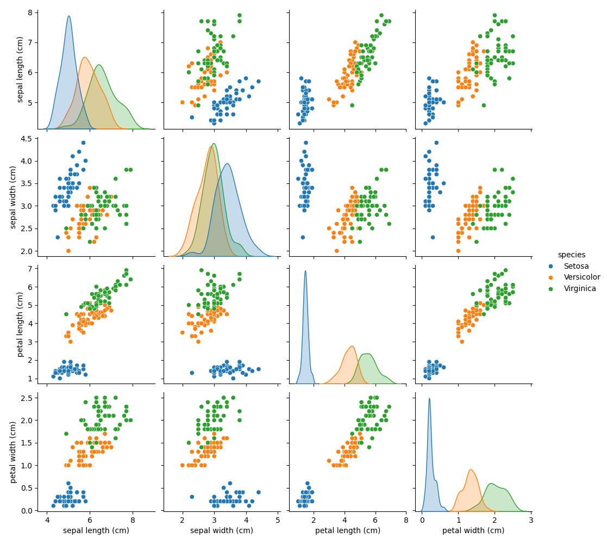
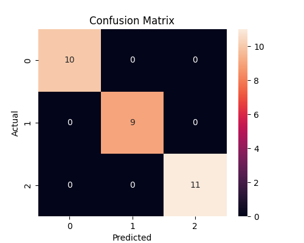

# 🌸 Iris Flower Classification using Machine Learning

## 📌 Overview

This project uses Machine Learning to classify Iris flowers into one of three species:

* Iris Setosa
* Iris Versicolor
* Iris Virginica

The model is built using the K-Nearest Neighbors (KNN) algorithm from Scikit-Learn and can predict the flower species based on sepal and petal measurements.

---

## 🎯 Objective

The objective of this project is to understand the complete Machine Learning workflow, including:

* Data Loading
* Data Visualization
* Data Preprocessing
* Model Training
* Model Evaluation
* Prediction on New Data

---

## 🛠️ Technologies Used

* Python
* Pandas
* NumPy
* Matplotlib
* Seaborn
* Scikit-Learn
* Git
* GitHub

---

## 📂 Project Structure

```text
iris-flower-classification/
│
├── images/
│   ├── pairplot.png
│   └── confusion_matrix.png
│
├── src/
│   └── iris_classification.py
│
├── requirements.txt
├── README.md
└── .gitignore
```

---

## 🔄 Machine Learning Workflow

1. Load Iris Dataset
2. Explore Dataset
3. Visualize Data using Pair Plot
4. Split Dataset into Training and Testing Sets
5. Train KNN Classification Model
6. Evaluate Model Accuracy
7. Generate Confusion Matrix
8. Predict Flower Species from User Input

---

## 📊 Data Visualization

### Pair Plot



### Confusion Matrix



---

## 🤖 Machine Learning Model

### Algorithm Used

K-Nearest Neighbors (KNN)

### Why KNN?

* Simple and effective classification algorithm
* Works well on small datasets
* Easy to understand for beginners

---

## 📈 Results

* Model Accuracy: 96% – 100%
* Successfully classified Iris flower species
* Generated visual insights using Seaborn and Matplotlib

---

## 💻 Sample Input

```text
Sepal Length: 5.1
Sepal Width: 3.5
Petal Length: 1.4
Petal Width: 0.2
```

### Output

```text
Predicted Flower Species: Setosa
```

---

## 🚀 How to Run

### Clone Repository

```bash
git clone https://github.com/mahathiii3/iris-flower-classification.git
```

### Install Dependencies

```bash
pip install -r requirements.txt
```

### Run Project

```bash
python src/iris_classification.py
```

---

## 📚 Concepts Learned

* Supervised Learning
* Classification
* K-Nearest Neighbors (KNN)
* Data Visualization
* Model Evaluation
* Confusion Matrix
* Train-Test Split
* Git & GitHub

---

## 👩‍💻 Author

**Mahathi Vaka**
